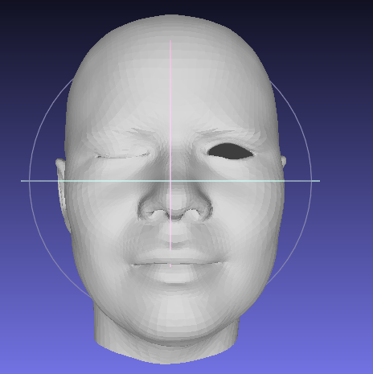
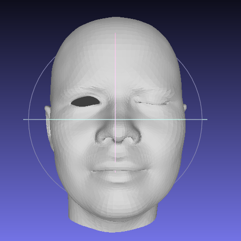
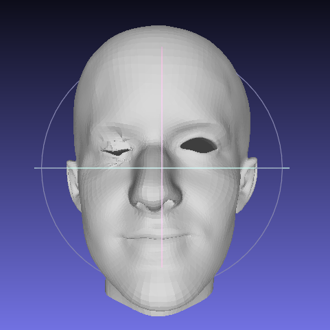
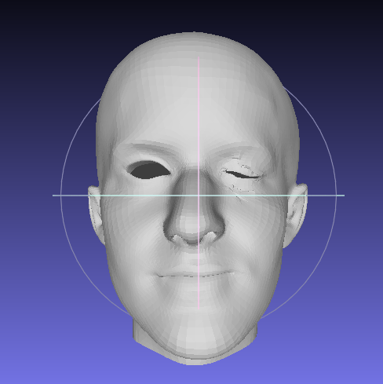

# Example-Based Facial Rigging
This is an implementation of "Example-Based Facial Rigging, Siggraph 2010."

It is a method for generating facial blendshape rigs from a set of example poses of a CG character.

<p align="center">


## Dependencies
* trimesh2
* Eigen 3.3.3
* SuiteSparse
* ceres solver 1.12.0

### install trimesh2
```
cd third_party/trimesh2
make clean && make
```

### install SuiteSparse
```
cd third_party/SuiteSparse
make
sudo make install
```

### install ceres
```
cd third_party/ceres-solver-1.12.0
mkdir build && cd build
cmake ..
make -j4
sudo make install
```
if error, please refer to `https://blog.csdn.net/calvinpaean/article/details/99761765`.


## Compile
```
mkdir build
cd build
cmake ..
make -j8

mkdir B
mkdir initBlendshape
mkdir reconstruct
mkdir S

./TestCases
```

## Results
<p align="center">

<p align="center">

<p align="center">
<em>Upper: reference blendshapes, Below: calculated blendshapes for another subject</em>

## Install problems

### install gflags
```
cd third_party/gflags
mkdir build && cd build
cmake -DCMAKE_INSTALL_PREFIX=/usr/local -DBUILD_SHARED_LIBS=ON -DGFLAGS_NAMESPACE=gflags ../ 
make -j4
sudo make install
```

### install glog
```
cd third_party/glog
./autogen.sh
./configure
make -j8
sudo make install
```

### if occurs error
```
usr/bin/ld: /usr/local/lib/libglog.a(libglog_la-logging.o): relocation R_X86_64_32 against `.rodata.str1.1' can not be used when making a shared object; recompile with -fPIC
/usr/local/lib/libglog.a: error adding symbols: Bad value
collect2: error: ld returned 1 exit status
```

please `./configure CPPFLAGS="-I/usr/local/include -fPIC" LDFLAGS="-L/usr/local/lib"`
